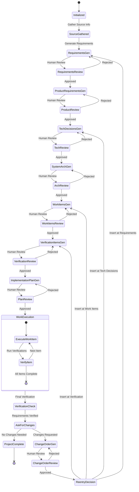

# SDLC Orchestrator Skill (Master Flow)

This orchestrator manages the high-level SDLC state machine, enforcing human gates and artifact traceability.

## SDLC Flow Diagram



## Workflow

1.  **Phase 0: Initialization (Init)**
    *   Invoke `project-setup` to create the project structure (`projects/{domain}/{project_id}/`).
    *   **Human Gate**: User approves project initialization. Mark "Project Initialized" in `status.md`.

2.  **Phase 1: Discovery (Disc)**
    *   **Source Gathering**: Prompt the user to provide context or add files to `inputs/`.
    *   **Interactive Discovery**: Offer to ask 10-20 targeted questions to clarify the project vision, user needs, and technical constraints if the initial inputs are insufficient.
    *   **Human Gate**: Mark "Inputs Gathered" in `status.md`.

3.  **Phase 2: Requirements (Req)**
    *   **Requirements Generation**: Invoke `prd-generator` to create atomic `requirements/R-*.md` and `requirements/index.md`.
    *   **Human Gate**: User approves atomic requirements. Mark "Requirements Approved" in `status.md`.
    *   **Product Requirements**: Invoke `prd-generator` to create `product-requirements.md`.
    *   **Human Gate**: User approves PRD. Mark "Product Requirements Approved" in `status.md`.

4.  **Phase 3: Technical Architecture (Tech Arch)**
    *   **Tech Stack Discovery**: Analyze the codebase and documentation to identify the current tech stack, existing architectural patterns, and constraints.
    *   **Tech Decisions**: Invoke `tech-plan-generator` to create `tech-decisions/D-*.md` and `tech-decisions/index.md`.
    *   **Human Gate**: User approves technical decisions. Mark "Tech Decisions Approved" in `status.md`.
    *   **System Architecture**: Invoke `tech-plan-generator` to create `systems-architecture.md`.
    *   **Human Gate**: User approves architecture. Mark "System Architecture Approved" in `status.md`.

5.  **Phase 4: Implementation Planning (Impl)**
    *   **Codebase Gap Analysis**: Analyze the existing codebase to determine the delta between the current state and the target architecture/requirements.
    *   **Work Items**: Invoke `implementation-planner` to create `work-items/W-*.md` and `work-items/index.md`.
    *   **Human Gate**: User approves work items. Mark "Work Items Approved" in `status.md`.
    *   **Verification Items**: Invoke `test-generator` to create `verifications/V-*.md` and `verifications/index.md`.
    *   **Human Gate**: User approves verification items. Mark "Verification Items Approved" in `status.md`.
    *   **Implementation Plan**: Invoke `implementation-planner` to create `implementation-plan.md`.
    *   **Human Gate**: User approves plan. Mark "Implementation Plan Approved" in `status.md`.

6.  **Phase 5: Execution (Exe)**
    *   Iteratively execute `W-*`.
    *   Maintain `status.md` and `artifact-map.md`.
    *   **Human Gate**: Implementation complete.

7.  **Phase 6: Verification (Verify)**
    *   Verify work via `V-*`.
    *   **Human Gate**: Final review and acceptance of completed work.

8.  **Phase 7: Change Management (Change Mgmt)**
    *   If changes are requested, create `changes/C-*.md`.
    *   Perform impact analysis and re-enter the flow at the appropriate phase (Discovery, Requirements, Tech, or Work Items).

## Final Folder Structure

```plaintext
projects/
    {domain}/
        {project_id}/
            product-requirements.md
            systems-architecture.md
            implementation-plan.md
            artifact-map.md
            status.md
            inputs/
            requirements/
                R-*.md // A file per requirement
                index.md // A index file that has links to all requirements files
            tech-decisions/
                D-*.md
                index.md
            work-items/
                W-*.md
                index.md
            verifications/
                V-*.md
                index.md
            changes/
                C-*.md
                index.md
```

## Artifact Definitions

### projects/{domain}/{project_id}/status.md
This file tracks the project's current state and human gates.

**Status Legend:**
- `[ ]` : Todo / Not Started
- `[/]` : In Progress
- `[X]` : Completed & Approved
- `[!]` : Dirty (Needs update due to upstream change)

### projects/{domain}/{project_id}/inputs/
The "source of truth" containing raw materials, briefs, transcripts, and reference documents.

### projects/{domain}/{project_id}/product-requirements.md
A high-level PRD synthesizing atomic requirements into a cohesive vision.

### projects/{domain}/{project_id}/systems-architecture.md
The Technical Design Document outlining the system structure and C4 diagrams.

### projects/{domain}/{project_id}/implementation-plan.md
A strategic roadmap detailing the rollout strategy and parallelization classes.

### projects/{domain}/{project_id}/artifact-map.md
A traceability matrix mapping Requirements (`R-*`) to Decisions (`D-*`), Decisions to Work Items (`W-*`), and Work Items to Verifications (`V-*`).

### projects/{domain}/{project_id}/requirements/
- **R-*.md**: Atomic, testable requirements with acceptance criteria.
- **index.md**: Master index of requirements categorized by domain.

### projects/{domain}/{project_id}/tech-decisions/
- **D-*.md**: Architectural Decision Records (ADRs) documenting technical choices and rationales.
- **index.md**: Chronological/thematic index of decisions.

### projects/{domain}/{project_id}/work-items/
- **W-*.md**: Actionable tasks for developers linked to `R-*` and `D-*` artifacts.
- **index.md**: Status tracker for all work items.

### projects/{domain}/{project_id}/verifications/
- **V-*.md**: Validation items defining test steps or scripts to verify `W-*` items.
- **index.md**: Index of project quality assurance coverage.

### projects/{domain}/{project_id}/changes/
- **C-*.md**: Change Order records for modifications requested after phase approval.
- **index.md**: Index of project scope evolution.

## Constraints
- Artifacts MUST be traceably linked in `artifact-map.md`.
- No phase can progress without its corresponding Human Gate being cleared in `status.md`.
- **State Consistency**: If any artifact, requirement, or technical decision is altered after its phase has been approved, all dependent artifacts and subsequent phases in `status.md` MUST be marked as "dirty" (needs re-verification). The orchestrator must then ensure these steps are updated and re-approved before proceeding.
