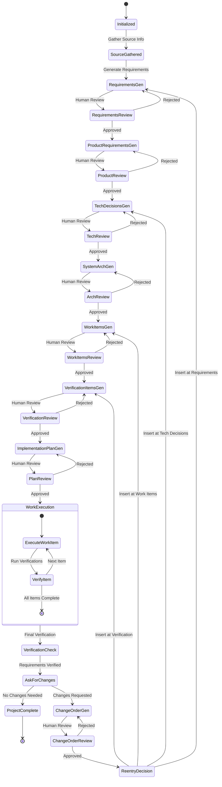

# SDLC Process Flow

1. Initial Project
    Create `inputs` folders in `projects/{domain}/{project_id}` (create `projects` folder if missing and domain and project-specific folder)
    Create a README.md in the project specific with a status list in it
    That README.md should have a path to the codebase/domain in question
2. Ask for context information via chat conversation or for the user to put supporting documents into the `inputs` folder
3. Create requirements atifact files and index
    Create this structure

4. Ask the user to review the requirements
5. Create the 

## SDLC Flow Diagram



## Final Folder Stucture

```plaintext
projects/
    {domain}/
        {project_id}/
            product-requirements.md
            systems-architecture.md
            implementation-plan.md
            artifact-map.md
            status.md
            inputs/
            requirements/
                R-*.md // A file per requirement
                index.md // A index file that has links to all requirements files, has them in categories in logical groups
            tech-decisions/
                D-*.md
                index.md
            work-items/
                W-*.md
                index.md
            verifications/
                V-*.md
                index.md
            changes/
                C-*.md
                index.md
```

## projects/{domain}/{project_id}/status.md

This file has information about the project and its current state.

Status Legend:
- `[ ]` : Todo / Not Started
- `[/]` : In Progress
- `[X]` : Completed & Approved
- `[!]` : Dirty (Needs update due to upstream change)

```markdown
# {Project Name}

## Current Status

### Init
[ ] Project Folder Structure Created
[ ] Initialized `status.md` and `README.md`
[ ] **Human Gate: Project Initialized**

### Disc
[ ] Source Information Gathered
[ ] **Human Gate: Inputs Gathered**

### Req
[ ] Atomic Requirements Generated
[ ] **Human Gate: Requirements Approved**
[ ] Product Requirements Document Generated
[ ] **Human Gate: Product Requirements Approved**

### Tech Arch
[ ] Tech Stack Discovered & Documented
[ ] Atomic Tech Decisions Generated
[ ] **Human Gate: Tech Decisions Approved**
[ ] Systems Architecture Document Generated
[ ] **Human Gate: Systems Architecture Approved**

### Impl
[ ] Codebase Gap Analysis Completed
[ ] Atomic Work Items Generated
[ ] **Human Gate: Work Items Approved**
[ ] Atomic Verification Items Generated
[ ] **Human Gate: Verification Items Approved**
[ ] Implementation Plan Generated
[ ] **Human Gate: Implementation Plan Approved**

### Exe
[ ] All Work Items Executed
[ ] **Human Gate: Implementation Complete**

### Verify
[ ] All Requirements Verified (via Work Items & Verification links)
[ ] **Human Gate: Final Review & Acceptance**

### Change Mgmt (If Needed)
[ ] Change Order Requested
[ ] Change Order Generated
[ ] **Human Gate: Change Order Approved**
[ ] Change Order Applied (Re-entry to appropriate phase)

### Project Completion
[ ] Project Complete
```

## projects/{domain}/{project_id}/inputs/

This directory serves as the "source of truth" for the project. It contains raw materials provided by the user, such as:
- Initial project briefs or transcripts.
- Existing codebase documentation or diagrams.
- Reference materials, screenshots, or legacy requirement docs.
- Any external context needed to bootstrap the discovery phase.

## projects/{domain}/{project_id}/product-requirements.md

A high-level Product Requirements Document (PRD) that synthesizes atomic requirements into a cohesive vision. It defines:
- The "What" and "Why" of the project.
- User personas and key user journeys.
- Links to related requirements.
- Success metrics and high-level goals.
- Out-of-scope items to prevent scope creep.

## projects/{domain}/{project_id}/systems-architecture.md

The Technical Design Document (Tech Plan) outlining the system's structure. It includes:
- C4 Diagrams (System, Container, Component).
- Data models and schema definitions.
- API specifications and communication patterns.
- Integration points with external systems.

## projects/{domain}/{project_id}/implementation-plan.md

A strategic roadmap for project execution. It details:
- The phased rollout strategy (e.g., MVP vs. V1).
- Dependency mapping between work items.
- Risk assessment and mitigation strategies.
- High-level milestones for project tracking.

## projects/{domain}/{project_id}/artifact-map.md

A traceability matrix that ensures every requirement is accounted for. It maps:
- Requirements (R-*) to Tech Decisions (D-*).
- Tech Decisions (D-*) to Work Items (W-*).
- Work Items (W-*) to Verifications (V-*).
- It provides a visual or tabular view of the project's logical integrity.

## projects/{domain}/{project_id}/requirements/R-*.md

Atomic requirement files. Each file focuses on a single, testable requirement and contains:
- Detailed description and business value.
- Clear acceptance criteria.
- Priority (Must-have, Should-have, etc.).
- Links to relevant inputs.

## projects/{domain}/{project_id}/requirements/index.md

A master index that organizes atomic requirements into logical categories (e.g., Authentication, Data Processing, UI/UX). It provides a quick overview of the total project scope and links to individual `R-*.md` files.

## projects/{domain}/{project_id}/tech-decisions/D-*.md

Architectural Decision Records (ADRs). Each file documents a significant technical choice, including:
- The problem or context.
- Options considered and their trade-offs.
- The final decision and rationale.
- Consequences or technical debt introduced.

## projects/{domain}/{project_id}/tech-decisions/index.md

A chronological or thematic index of all technical decisions. It serves as a history of the project's technical evolution and a reference for future developers.

## projects/{domain}/{project_id}/work-items/W-*.md

Specific, actionable tasks for developers. Each file includes:
- Technical implementation details.
- References to the `R-*` and `D-*` files it fulfills.
- Estimated complexity.
- A checklist of implementation steps.

## projects/{domain}/{project_id}/work-items/index.md

A master list and status tracker for all work items. It facilitates project management by showing which tasks are Todo, In-Progress, Blocked, Completed, or Verified.

## projects/{domain}/{project_id}/verifications/V-*.md

Validation items (tests) used to confirm that work items meet their requirements. Each file defines:
- The verification method (Unit test, Manual QA, Integration test).
- Test steps or scripts to execute.
- Expected vs. Actual results.
- Links to the `W-*` item being verified.

## projects/{domain}/{project_id}/verifications/index.md

A comprehensive index of the project's quality assurance coverage. It ensures that every work item has a corresponding verification and tracks the overall health of the project.

## projects/{domain}/{project_id}/changes/C-*.md

Change Order records. Used when a user requests a modification after a phase is approved. They contain:
- The reason for the change.
- Impact analysis on existing requirements and architecture.
- Approval status and re-entry point in the SDLC flow.

## projects/{domain}/{project_id}/changes/index.md

An index of all changes requested during the project lifecycle, providing transparency into how the scope evolved over time.

## projects/{domain}/{project_id}/

The project root directory. It contains the high-level artifacts (`product-requirements.md`, `systems-architecture.md`, etc.) and the sub-directories for atomic items, serving as the centralized "brain" for the project.
